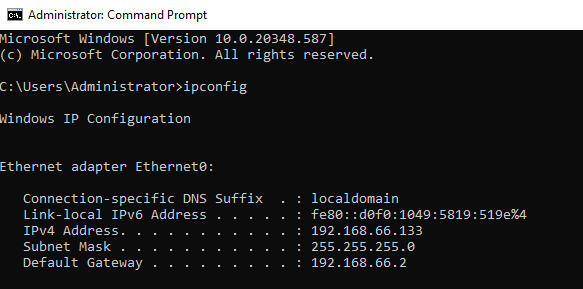

# Installing GPMC (Group Policy Management) on Windows Server VM

1. Click on Manage(Top Right) and Select Add Roles and Features
2. In Server Roles, select AD Domain Services, Remote Access, and DNS
3. In Features, select Group Policy Management
4. Proceed with default setup and click install

# Configure Windows Server 

## Configure server with static IP address on Windows Server VM

1. In Search tool, open Command Line Prompt (CMD)

2. Type "ipconfig" and copy IP Address credentials

3. Navigate to Network & Internet Settings -> Advanced Network Settings

3. Select the "Change Adapter Option" and click on "Ethernet0"

4. Select Properties -> Internet Version Protocol 4 (TCP/IPV4), select "Use The Following IP Address", fill in IP address credentials and Alternative DNS Server (Ex: Google Server -> 8.8.8.8), click "OK"

5. To confirm configuration, type "ipconfig /all" in CMD, results should be similar to the example

# Configure Client Server 

## Configure Client Server on Windows Enterprise VM

1. Static IP Address not neccessary for Client servers
2. Navigate to Network & Internet Settings -> Advanced Network Settings -> "Change Adapter Option" -> "Ethernet0" -> Select Properties -> Internet Version Protocol 4 (TCP/IPV4)

3. In TCP/IPv4 Properties, select "Use the following DNS server addresses" and fill in IPv4 address from Windows Server as "Preferred DNS server" and Google Server(8.8.8.8) as "Alternative DNS Server", click OK

4. To Test Domain Controller Connection, proceed to type in CMD "nslookup Domain Name", which should have an IP Address assigned to the Domain like the Example below.

## Add Computer to the Domain

1. Navigate to File Explorer -> Right-click on "This PC" -> Properties -> "Rename this PC (advanced)" 

2. In System Properties, type your Domain name and click OK

3. Confirm Domain changes by filling credentials

4. Succefully Added Computer to the Domain! and sysem will restart

5. Once System is restarted, in "Other User", login with one of the user credential created in Windows Server VM.

