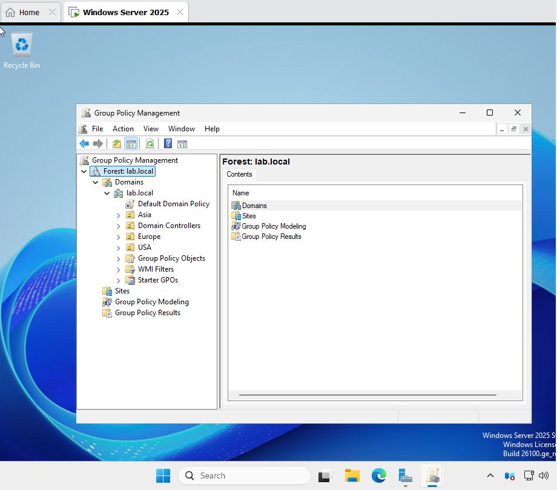
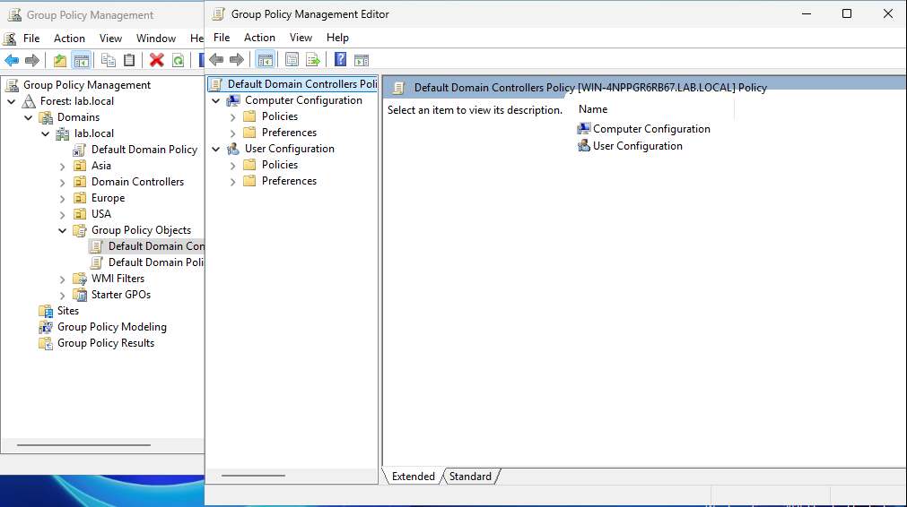
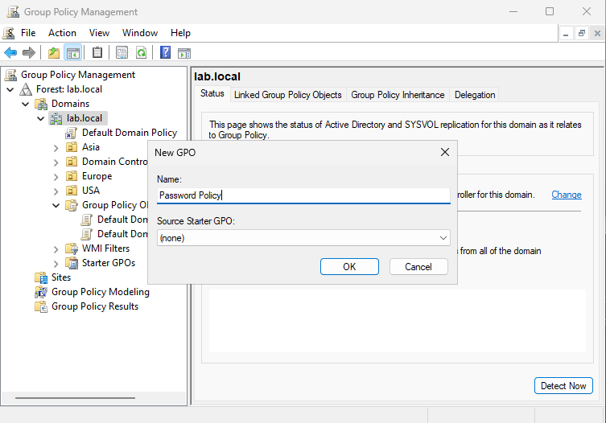
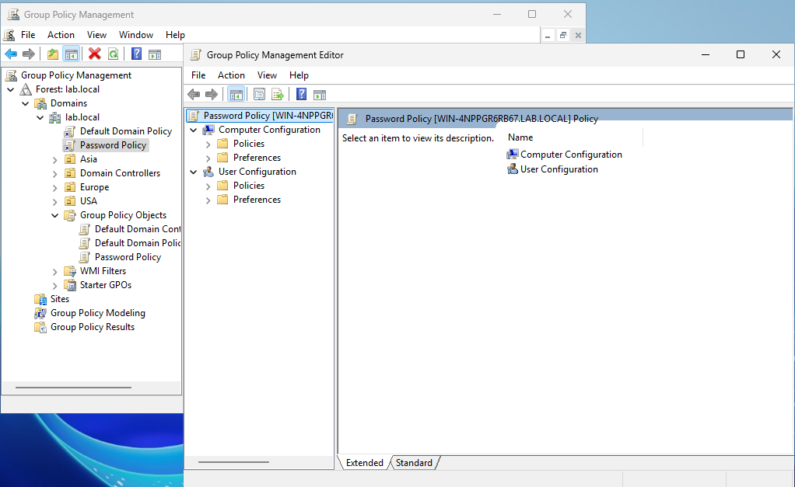
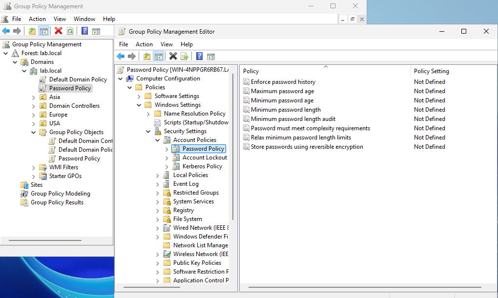
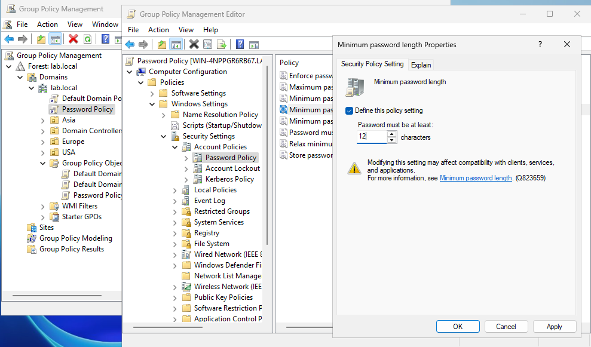
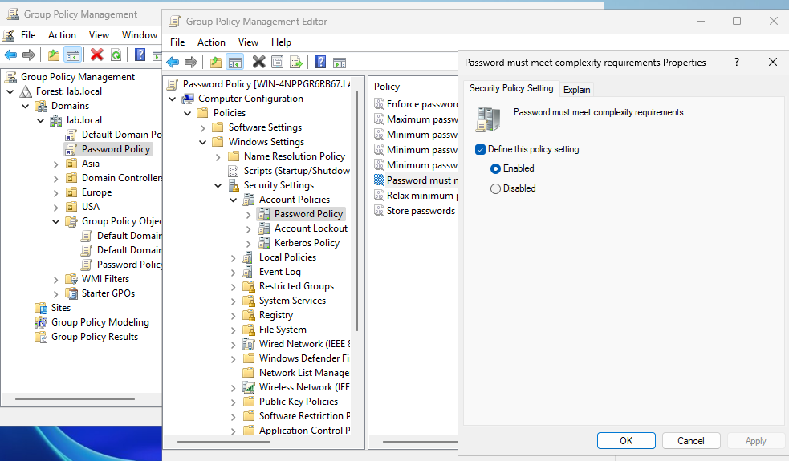
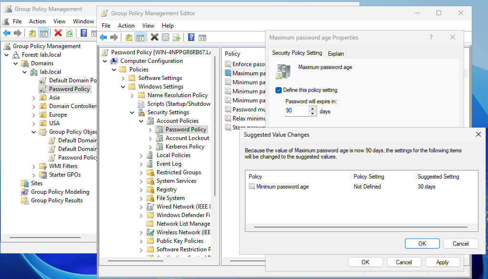
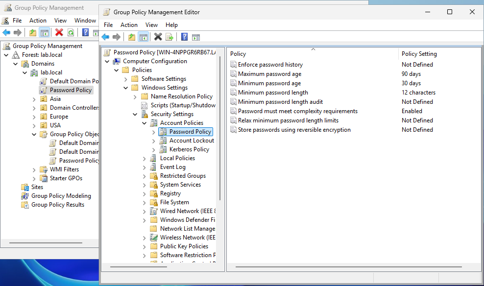

# GPMC (Group Policy Management) Lab

## Step 1: Navigating Group Policy Object's (GPO's)

1. In VM, open Group Policy Management, and elect your AD domain

2. Go into "Group Policy Object" folder and right-click Default Domain Controllers Policy -> Edit

3. Select where to create a GPO:
    - Computer Configuration - settings that apply to the whole computer.
    - User Configuration - settings that apply only to a specific user account.

## Step 2: Create/Setup a GPO (Password Policy)

1. Open Group Policy Management, right-click domain name -> select "Create a GPO in this domain, and Link it here..."
2. Create GPO name (Use Descriptive Naming)

3. Right-click on newly created policy -> select "Edit"

4. Navigate to Computer Configuration -> Policies -> Windows Settings -> Security Settings -> Account Policies -> Password Policy 

5. Select "Minimum password length", click "Define this policy setting", initiate minimum password length, click "Apply" and  "OK"

6. Select "Password must meet complexity requirements", click "Define this policy setting", Select "Enable" , click "Apply" and  "OK"

7. Select "Maximum password age", click "Define this policy setting", initiate password expiration, click "Apply" and  "OK"

8. On the Policy Setting (Right Column) all changes to poicy are visible

## Step 3: Create/Setup a GPO (Drive Mapping Policy)
