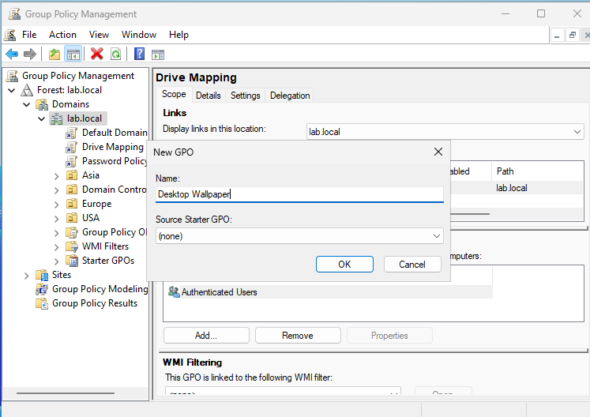

# GPMC (Group Policy Management) Lab

## Step 1: Navigating Group Policy Object's (GPO's)

1. In VM, open Group Policy Management, and elect your AD domain

2. Go into "Group Policy Object" folder and right-click Default Domain Controllers Policy -> Edit

3. Select where to create a GPO:
    - Computer Configuration - settings that apply to the whole computer.
    - User Configuration - settings that apply only to a specific user account.

## Step 2: Create/Setup a GPO (Password Policy) - To enforce strong passwords and enhance security

1. Open Group Policy Management, right-click domain name -> select "Create a GPO in this domain, and Link it here..."
2. Create GPO name (Use Descriptive Naming)

3. Right-click on newly created policy -> select "Edit"

4. Navigate to Computer Configuration -> Policies -> Windows Settings -> Security Settings -> Account Policies -> Password Policy 

5. Select "Minimum password length", click "Define this policy setting", initiate minimum password length, click "Apply" and  "OK"

6. Select "Password must meet complexity requirements", click "Define this policy setting", Select "Enable" , click "Apply" and  "OK"

7. Select "Maximum password age", click "Define this policy setting", initiate password expiration, click "Apply" and  "OK"

8. On the Policy Setting (Right Column) all changes to poicy are visible

## Step 3: Create/Setup a GPO (Drive Mapping Policy) - Map network drives for users when they log in

1. In VM, open Group Policy Management, right-click domain name -> select "Create a GPO in this domain, and Link it here..."
2. Create GPO name (Use Descriptive Naming)

3. Right-click on newly created policy -> select "Edit"

4. Navigate to User Configuration -> Preferences -> Windows Settings -> Drive Maps

5. Right-click on Drive Maps -> New -> select Mapped Drive

6. fill "Location" with path of network share, in "Drive Letter" select "Use" and a Drive(A-Z), click "Apply" and "OK"

## Step 4: Create/Setup a GPO (Desktop Wallpaper Policy) - Set a default desktop wallpaper for all users

1. In VM, open Group Policy Management, right-click domain name -> select "Create a GPO in this domain, and Link it here..."
2. Create GPO name (Use Descriptive Naming)

3. Right-click on newly created policy -> select "Edit"

4. Navigate to User Configuration -> Policies -> Administrative Templates -> Desktop -> Desktop

5. Select "Desktop Wallpaper", select "Enabled", fill in Wallpaper Name with path of wallpaper, click "Apply" and "OK"

## Step 5: Create/Setup a GPO (Restrict Control Panel) - Prevent users from accessing the Control Panel 

1. In VM, open Group Policy Management, right-click domain name -> select "Create a GPO in this domain, and Link it here..."
2. Create GPO name (Use Descriptive Naming)

3. Right-click on newly created policy -> select "Edit"

4. Navigate to User Configuration -> Policies -> Administrative Templates -> Control Panel

5. Select "Prohibit access to Control Panel & settings", select "Enabled", click "Apply" and "OK"

## Step 6: Create/Setup a GPO (Disable USB Storage) - Prevent users from using USB storage devices

1. In VM, open Group Policy Management, right-click domain name -> select "Create a GPO in this domain, and Link it here..."
2. Create GPO name (Use Descriptive Naming)

3. Right-click on newly created policy -> select "Edit"

4. Navigate to Computer Configuration -> Policies -> Administrative Templates -> System -> Removable Storage Access

5. Select "All Removable Storage classes: Deny all access", select "Enabled", click "Apply" and "OK"

