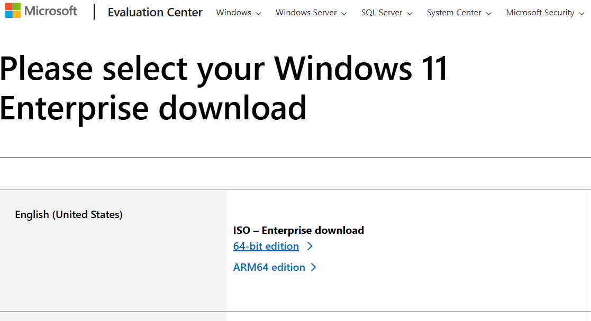
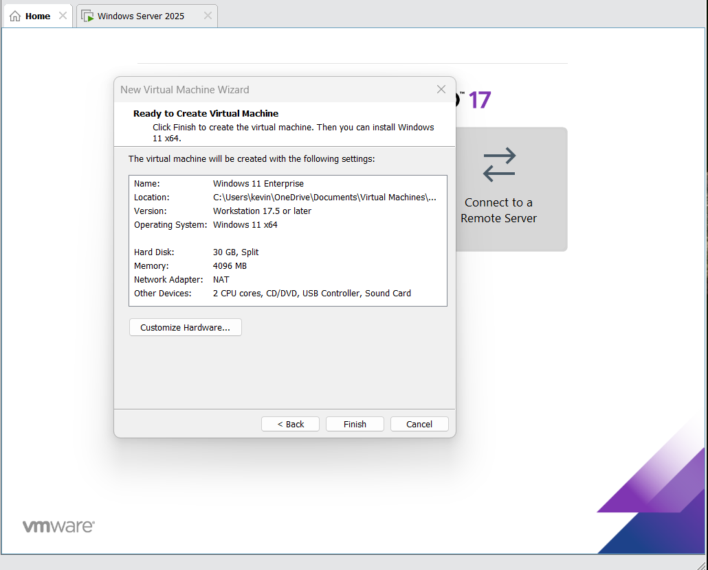

# Installing Windows Client Virtual Machine

## Step 1: Download ISO for  Windows 10/11 Pro or Enterprise

1. Download the Windows ISO for 10/11 Pro or Enterprise from the Microsoft Evaluation Center.

## Step 2: Create Windows Client Virtual Machine

1. Open a VM, select "Create a New Virtual Machine"
2. In Virtual Machine Wizard, select "I will install the operating system later,select Operating System version, create Virtual machine name, set max disk size, and click "Finish"

3. Right-Click on Windows Server Version(left panel), select on settings
3. In CD/DVD (SATA), click on ISO image file & upload windows ISO
4. Power on Virtual Machine and press Any Key To start

